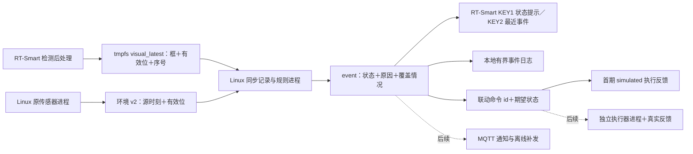

# 板端报警、融合与联动推进方案｜2026-10-01

状态：设计与实施顺序；真实检测结果输出尚未打通，不宣称端到端报警。用户确认暂时没有额外蜂鸣器、LED、烟雾模块或执行器，因此先完成屏幕事件与软件反馈，实体联动单列后续阶段。模型训练仍暂停。

## 当前可直接复用的部分

| 部分 | 真实现状 | 本轮处理 |
|---|---|---|
| 视觉 | 原厂 ELF＋早期四类 640 KModel，屏幕画框、约 220 ms 单轮日志 | 保留；先解决结构化结果输出，不把耗时当检测数据 |
| 环境 | SHT31 温湿度、BMP280 气压；Linux K2 控制采样 | 由现有进程独占 I²C，融合进程不重复开总线 |
| 跨核显示 | Linux tmpfs 的 status/history，经 /sharefs 提供给 RT-Smart | 继续服务 KEY1/KEY2；新增独立文件，不破坏 v1 接口 |
| 规则 | fusion_replay.py，NORMAL/WATCH/WARNING/ALARM/UNKNOWN，持续、锁定、复位和缺数规则 | 可复用逻辑；其示例阈值是合成数据参数，不直接复制到厨房 |
| 声光与执行器 | 用户确认暂时没有额外模块 | 首期只接屏幕/事件记录；虚拟执行反馈明确标记 simulated |
| 烟雾、CO、燃气 | 无真实通道 | 输入为空并标无效，不拿视觉 smoke 类或气压冒充传感器 |

## 先补视觉输出这个工程入口

当前串口只有推理耗时，未验证厂商 ELF 可以输出每帧框、类别与置信度。已有源码 src/kitchen_fire_yolov8 有 Detection 和 post_process，但不是与在用 ELF 同源、摄像链已验收的构建，曾有 GC2093/MPP ABI 问题。这是事件链最先要解决的门槛。

先检查原程序是否已有可用调试/结果接口；没有就用独立文件名修复可维护源码的相机/connector/MPP 兼容，先复现原画面与稳定退出，再在后处理结果处写一份原子替换的 visual_latest.json。不得从蓝框屏幕颜色反推框或把识别耗时转换成 fire_conf。每份记录至少包含 boot/session、frame_seq、源时刻、输入尺寸、模型 SHA、阈值、有效标志和完整框列表。空列表表示有效帧未检测到目标；视觉停用或读取失败是无效，二者不同。

灶头 ROI 必须按实际固定机位人工确认并版本化。模型 stove 框不是经过标定的灶头范围；相机或灶具移动后 ROI 失效。几何计算用原始检测坐标，与 KEY1 面板是否遮住屏幕无关。

## 数据与进程怎么连接

Linux 负责融合、环境记录与后续执行器服务，RT-Smart 保留相机/显示。新进程只读采样数据；每个输出文件单写者、临时文件＋rename。实时状态留在 tmpfs，只在事件转移或限速检查点保存 SD，日志设置大小/数量上限。正式 KEY2 不因融合进程失败退出。

两核心 CLOCK_MONOTONIC 不能未经测量直接相减。第一版统一以 Linux 接收新序号的时间记录对齐，同时保留 RT 源时刻；传输年龄/偏移须通过握手测量后再用于报警延迟。Linux 环境 v2 应带实际采样/接收时刻、boot_id、seq、每通道有效位及 freshness，旧 status.txt 保留兼容。每次重启/源序号回退重置持续计时；断档不累计为“持续异常”。

## 怎么判断，而不是看到火就报警

正常灶火本身允许存在。第一版只评估：火焰是否持续离开已确认灶头、面积是否异常扩展、温度相对固定安装位置的基线是否持续改变。湿度只作蒸汽线索，不抵消已观察到的风险；气压继续显示与记录，不参与火灾阈值。环境温度是慢响应辅助量，不能承诺能抓到快速火情。

| 状态 | 当前建议行为 |
|---|---|
| UNKNOWN／证据不足 | 必要通道停用、过期、ROI 不明或标定未完成，且无已观察到的异常；附缺失原因 |
| WATCH／关注 | 单次越界火焰或环境异常；留证据、不触发执行器 |
| WARNING／预警 | 异常达到经实测冻结的持续条件；醒目屏幕提示并存事件 |
| ALARM／报警 | 只有经过对应场景验证的组合规则或独立报警输入触发；锁定，风险撤销且证据恢复后人工复位 |
| NORMAL／正常 | 所用规则要求的通道完整、标定有效、无异常；不因为画面暂时没框就宣布安全 |

已有规则在缺烟雾时无异常输出 UNKNOWN，但可继续对观察到的越界火焰输出 WATCH/WARNING，缺数不会掩盖正向异常。当前无烟雾通道，所以先展示实际覆盖情况，不能宣称完整多传感器火灾融合已完成。采用哪种视觉＋温度实验规则，需记录实际安装位置、稳定基线与完整事件后冻结配置；现有 0.25/0.35/0.7/3°C/8°C/2s/4s 参数不直接上板。

报警页可以用显式 TEST 输入验证锁定、确认/静音/复位流程，但 TEST 来源与真实传感器事件分开记录和显示，不计入识别准确率。矩阵 KEY3/KEY4 是否作为确认/复位键，待对应引脚实测后再分配，保留 KEY1/KEY2 当前职责。

## 首期闭环与后续实体联动

首期：真实视觉/环境输入→规则原因→屏幕预警与最近事件→命令与 simulated 确认。模拟仅用于验证动作协议与恢复行为；没有硬件反馈时不得显示“风扇已启动”“已关阀”。

后续有低压蜂鸣器/指示灯时，先实现本地提示；实体执行器确定型号、电压、驱动与供电后再做接线。独立驱动进程收到 command_id 去重，返回 accepted、applied 或 failed，并区分“命令已发出”与“实际位置/状态已确认”。仅 GPIO 设置成功不是机械动作完成。风扇、舵机、继电器做什么需按装置目标单独确定，不预先把所有 ALARM 映射成同一动作。

MQTT 排在本地闭环后：断网不影响本地提示，事件有稳定 ID、限长队列和重连去重；连接状态依据真实 broker 会话/确认，不用 wlan0 有 IP 冒充服务可用。

## 实施次序与验收证据

1. KEY1 蓝框：先短时图层试验，记录实际写入/恢复和屏幕反馈，成功后再候选固化，复测 KEY1/KEY2/K1 和重启。
2. 视觉结构化输出：先复现摄像/退出，再验证有目标、空帧、停用、超时、尺寸和模型身份；这个门槛没过不冒充真实融合。
3. 真实同步记录：比较两个源的序号、接收时间、失效标志和重启，保持当前 UI 向后兼容。
4. 规则上板：以记录回放对齐现有解释规则，完成实际正常灶火/遮挡/开关火/蒸汽等事件记录，冻结本机位候选条件。
5. 本地屏幕与有界事件日志、显式模拟反馈：验证锁定、静音/复位、进程失败与恢复；真实事件和 TEST 分开。
6. 有硬件后做声光/执行反馈，再做 MQTT、掉电/断网与长时验收。逐事件报告误报、漏报和延迟；没有异常真值时不报告异常检出率。

本轮只制定方案并研究显示，不更改既有融合规则或接线。新增实现分别做小提交、构建身份和设备回退记录，避免把模型、显示与规则一起更换后无法定位问题。
