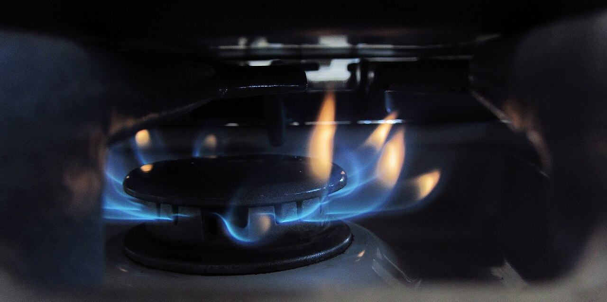

# 蓝焰参考图

作者：Lisafern / Lisa Redfern。来源：[Gas stove burner flame.jpg](https://commons.wikimedia.org/wiki/File:Gas_stove_burner_flame.jpg)。许可：[CC0 1.0](https://creativecommons.org/publicdomain/zero/1.0/)。本文件是 Commons 提供的 1280 像素缩略图，未再修改。SHA-256：50b33ef859a8035d714fa61899c1ec619d186a65b656b455316fb7ad390a5855。

用途：说明正常燃气火焰也包含蓝色与黄色部分，需要目标位置与事件过程共同分析。该图仍为待审来源候选，未加入 v5/v6，也不作为正式盲测。
